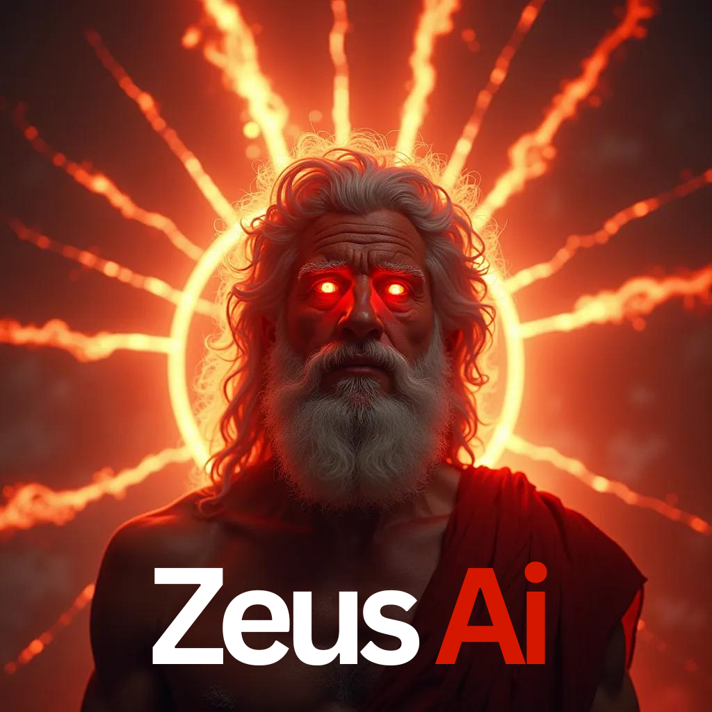

# Zeus Multimodal

  

## This repo is a preview of how the Zeus model is developing, there are still errors that will be fixed and I hope it will be soon, and thus deliver this trained model very soon :b

# Please read the [LICENSE](LICENSE.txt) before using this repository :b

## This model is based on Chameleon's Meta AI Paper, a native multimodal model like GPT-4o

## Download test checkpoint

You can download the checkpoint at huggingface (Note: it is just a test checkpoint, it has only been trained in 61 steps) 
Link: https://huggingface.co/RiveraAI/Zeus-Multimodal-InProgress

## Star History

